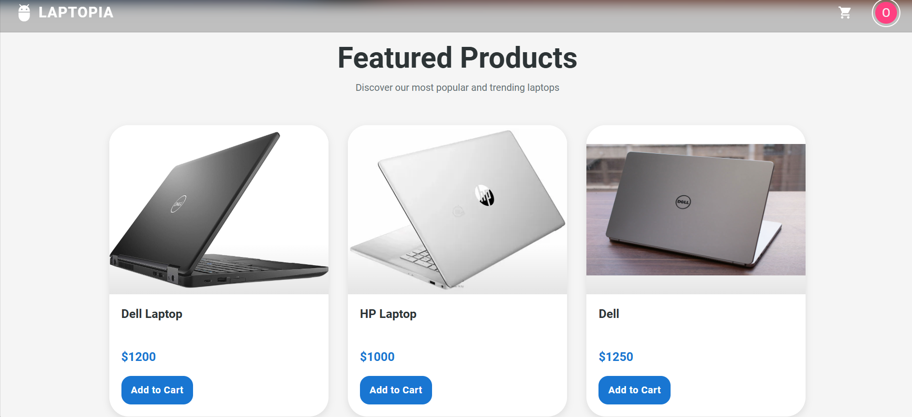
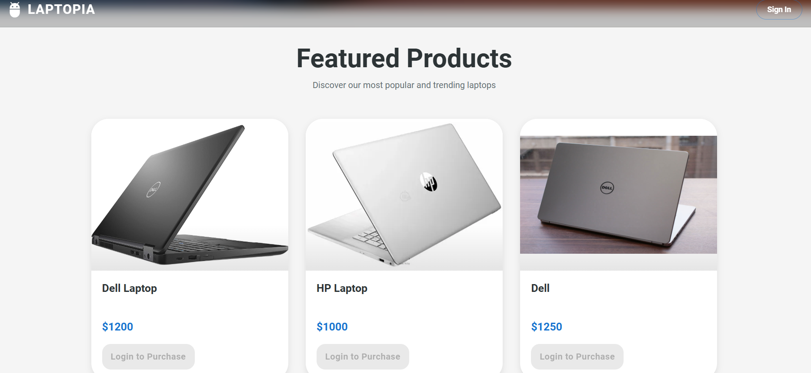
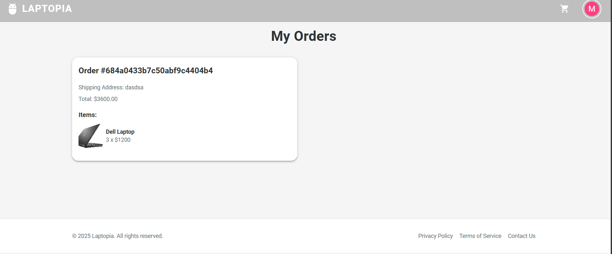
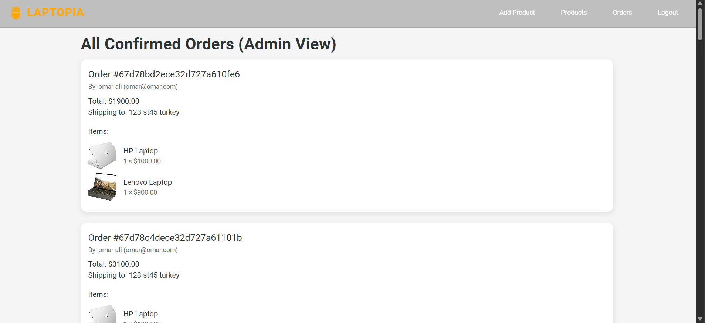

# Laptopia

**A full-stack e-commerce storefront** — browse a catalogue, fill a cart, check
out, and manage inventory and orders from a role-gated admin area.

[](https://github.com/Omer-Mevlutoglu/E-commerce_MERN/actions/workflows/ci.yml)
[](https://reactjs.org/)
[](https://nodejs.org/)
[](https://www.typescriptlang.org/)
[](https://www.mongodb.com/)
[](#-testing)


> **▶ [Watch the demo](https://youtu.be/Vn9fql7lTDA)** — the full customer and
> admin journey in a couple of minutes.

---

## Contents

- [What it does](#-what-it-does)
- [Screenshots](#-screenshots)
- [Architecture](#-architecture)
- [Tech stack, and why](#-tech-stack-and-why)
- [Running it](#-running-it)
- [API](#-api)
- [Testing](#-testing)
- [Deployment](#-deployment)
- [Known limitations](#-known-limitations)

---

## ✨ What it does

### For customers

- **Browse** a paginated catalogue with search, category filters and sorting.
- **Product pages** with description, brand, live stock and add-to-cart.
- **A cart that behaves** — adding something already in it increases the
  quantity, prices are locked at the moment of adding, and quantities are
  checked against real stock.
- **Checkout** that decrements stock atomically, so the shop cannot oversell.
- **Order history** with a fulfilment status on every order.

### For admins

- **Product management** — create, edit, retire and restore. Retiring is a soft
  delete, so carts holding the product never break.
- **Order management** — every customer order, with a status you can advance
  through `processing → shipped → delivered`.
- **Separated by role at the API, not just the UI** — a customer token is
  refused by admin endpoints and an admin token is refused by cart endpoints.

### Under the hood

- **No card data is ever accepted or stored.** The browser validates the card
  and sends only the last four digits and the brand.
- **Checkout is transactional** where the database supports it, with a
  compensating-write fallback where it does not. Two simultaneous checkouts for
  the last unit cannot both succeed.
- **Every request body, param and query is schema-validated**, and every error
  comes back in one JSON envelope.

---

## 📸 Screenshots

| Storefront | Catalogue |
| --- | --- |
|  |  |

| Cart | Admin |
| --- | --- |
|  |  |

---

## 🏗 Architecture

```
                      ┌──────────────────────────────────┐
   Browser  ─────────▶│  React 19 + Vite  (static SPA)   │
                      │  ├─ AuthProvider   session/JWT   │
                      │  ├─ CartProvider   cart state    │
                      │  ├─ FeedbackProvider  toasts     │
                      │  └─ api/client.ts  one fetch     │
                      └────────────────┬─────────────────┘
                                       │  /api/v1/*  (Bearer JWT)
                      ┌────────────────▼─────────────────┐
                      │  Express + TypeScript            │
                      │                                  │
                      │  helmet · CORS · rate limiting   │
                      │            ↓                     │
                      │  routes/     thin HTTP adapters  │
                      │            ↓                     │
                      │  middlewares/  JWT → role → zod  │
                      │            ↓                     │
                      │  services/   all business logic  │
                      │            ↓                     │
                      │  models/     Mongoose schemas    │
                      │            ↓                     │
                      │  errorHandler  one JSON envelope │
                      └────────────────┬─────────────────┘
                                       │
                      ┌────────────────▼─────────────────┐
                      │  MongoDB  (replica set → txns)   │
                      └──────────────────────────────────┘
```

**The layering is the point.** Routes parse and respond; services hold every
business rule and throw typed `AppError`s; models only describe data. A service
never touches `req` or `res`, so the rules are testable without HTTP — which is
why the cart logic has 28 tests that need no server.

**Two flows worth tracing:**

<details>
<summary><strong>Checkout</strong> — how overselling is made impossible</summary>

```
POST /api/v1/cart/checkout
  validateJWT      → 401 if the token is bad or the account is gone
  requireUser      → 403 for an admin token
  validate(zod)    → 400 with field-level detail
  cartService.checkOut
    cart empty?                        → 400 EmptyCart
    for each line, one atomic update:
      findOneAndUpdate(
        { _id, stock: { $gte: qty } },   ← filter and write are one operation,
        { $inc: { stock: -qty } })         so a check-then-write race cannot occur
      no match                         → 409 InsufficientStock
    create order  (denormalised item copies — history survives a rename)
    mark the cart completed
  all of the above inside one transaction where available;
  otherwise reservations are rolled back by hand on failure
```

</details>

<details>
<summary><strong>Sign-in</strong> — where the role is enforced</summary>

```
POST /api/v1/auth/login  →  { token }         role embedded in the JWT
  AuthProvider decodes it, checks exp, stores it
  api/client.ts attaches it to every request and signs out on any 401

Backend enforces independently on every request:
  validateJWT   verifies the signature, then loads the user from the database
  requireUser / requireAdmin  compare the role
```

The frontend guards are convenience, not security — the API is authoritative
and is tested for both directions.

</details>

---

## 🛠 Tech stack, and why

| Choice | Why this one |
| --- | --- |
| **TypeScript everywhere** | `strict` on both sides. The typo that shipped in the original schema (`productTtile`) is exactly what types plus a migration are for. |
| **React Context, not Redux** | Two small, rarely-changing slices — session and cart. A state library would be ceremony without benefit, and the providers are 90% covered by tests. |
| **Zod at the boundary** | One schema per endpoint drives validation, TypeScript types **and** the OpenAPI spec, so the docs cannot drift from the behaviour. |
| **Mongoose + MongoDB** | The cart is naturally a document, and orders denormalise their line items so history stays accurate after a product is renamed or retired. |
| **MUI** | A complete, accessible component set. The time saved went into correctness instead of rebuilding date pickers. |
| **Vitest + Testing Library + MSW** | MSW intercepts at the network layer, so components run their real fetch code rather than a stub. |
| **`mongodb-memory-server`** | Tests spin up a real in-memory **replica set**, so they exercise the transactional checkout path and CI needs no database service. |
| **Playwright** | The only way to catch integration bugs like the effect-ordering one described in [known limitations](#-known-limitations). |

---

## 🚀 Running it

### Option A — Docker (one command)

```bash
docker compose up --build
```

- **Web** → [localhost:5173](http://localhost:5173)
- **API** → [localhost:3001](http://localhost:3001) · health at `/health` · docs at `/api/docs`
- **MongoDB** → `localhost:27017`, started as a single-node **replica set**, so
  checkout runs inside a real transaction.

Demo accounts are seeded automatically:

| Role | Email | Password |
| --- | --- | --- |
| Customer | `demo@laptopia.dev` | `Demo1234!` |
| Admin | `admin@laptopia.dev` | `Admin1234!` |

### Option B — Manual

**Prerequisites:** Node 20+, MongoDB, Git.

```bash
git clone https://github.com/Omer-Mevlutoglu/E-commerce_MERN.git
cd E-commerce_MERN
```

**Backend**

```bash
cd backend
npm install
cp .env.example .env
npm run dev
```

The server validates its environment at boot and refuses to start if anything
is missing. `JWT_SECRET` must be **at least 32 characters**:

```bash
node -e "console.log(require('crypto').randomBytes(48).toString('hex'))"
```

> A standalone `mongod` works, but checkout falls back to compensating writes
> instead of transactions. For full atomicity use a replica set
> (`mongod --replSet rs0`, then `rs.initiate()`) or MongoDB Atlas.

**Frontend**

```bash
cd ../frontend
npm install
cp .env.example .env
npm run dev
```

### Scripts

Run these from the repo root to hit both apps at once:

| Command | Does |
| --- | --- |
| `npm run verify` | lint → typecheck → test → build, everything |
| `npm test` | both test suites |
| `npm run lint` | both linters |
| `npm run format` | Prettier across the repo |
| `npm run dev:api` / `npm run dev:web` | start one side |

Per app: `npm run build`, `npm start`, `npm run typecheck`,
`npm run test:coverage`, `npm run seed:demo`, `npm run migrate:orders`.

---

## 📚 API

**Interactive docs: [`/api/docs`](http://localhost:3001/api/docs)** (Swagger UI),
raw spec at `/api/v1/openapi.json`. The spec is generated from the same Zod
schemas the API validates with, so it cannot drift from the real behaviour.

Everything lives under **`/api/v1`**. Errors always come back as:

```jsonc
{
  "error": "ValidationError",       // machine-readable code
  "message": "Invalid request body",
  "details": { "price": ["Price cannot be negative"] }
}
```

`400` invalid input · `401` not authenticated · `403` authenticated but not
permitted · `404` not found · `409` conflict (out of stock, email taken).

<details>
<summary><strong>Endpoint reference</strong></summary>

### Public

| Method | Path | Description |
| --- | --- | --- |
| `GET` | `/products` | Catalogue — paginated, filterable, searchable |
| `GET` | `/products/:productId` | A single product |
| `GET` | `/products/categories` | The category list the filters use |
| `POST` | `/auth/register` | `{ firstName, lastName, email, password }` → `{ token }` |
| `POST` | `/auth/login` | `{ email, password }` → `{ token }` |

The listing accepts `page`, `limit` (max 48), `search`, `category`
(`laptops` \| `gaming` \| `ultrabooks` \| `accessories`) and `sort`
(`newest` \| `price-asc` \| `price-desc` \| `title-asc`), and responds with
`{ items, page, limit, total, totalPages, hasNextPage }`. Search runs against a
MongoDB text index over title, brand and description, weighted so a title match
ranks highest.

Registration always creates a customer — the role is never read from the
request. Both auth endpoints are rate-limited to 10 attempts per 15 minutes.

### Customer (`role === "user"`)

| Method | Path | Description |
| --- | --- | --- |
| `GET` | `/cart` | Active cart, products populated |
| `POST` | `/cart/items` | `{ productId, quantity }` — increments if already present |
| `PUT` | `/cart/items` | `{ productId, quantity }` — sets the quantity |
| `DELETE` | `/cart/items/:productId` | Remove one line |
| `DELETE` | `/cart` | Empty the cart |
| `POST` | `/cart/checkout` | `{ fullName, address, payment: { last4, brand } }` |
| `GET` | `/orders` | The customer's orders, newest first |

### Admin (`role === "admin"`)

| Method | Path | Description |
| --- | --- | --- |
| `GET` | `/admin/products` | All products, retired included |
| `GET` | `/admin/products/:productId` | One product, retired included |
| `POST` | `/admin/products` | Create |
| `PUT` | `/admin/products/:productId` | Partial update |
| `DELETE` | `/admin/products/:productId` | Retire (soft delete) |
| `POST` | `/admin/products/:productId/restore` | Un-retire |
| `GET` | `/admin/orders` | Every order with customer details |
| `PATCH` | `/admin/orders/:orderId/status` | `{ status }` |

### Health

`GET /health` → `{ status, uptime, db }`. Unversioned; used by Railway and the
container healthchecks.

</details>

---

## 🧪 Testing

**181 tests.** Every push runs lint, typecheck, tests and build for both apps,
then the E2E suite against a real API and database.

```bash
npm test          # both suites
npm run verify    # lint + typecheck + test + build
```

| Suite | Count | Tooling | Covers |
| --- | ---: | --- | --- |
| Backend unit + integration | 106 | Vitest · Supertest · in-memory replica set | services, middleware, every endpoint |
| Frontend component | 66 | Vitest · Testing Library · MSW | providers, guards, API client, pages |
| End-to-end | 15 | Playwright (Chromium) | customer purchase and admin journeys |

**Coverage: 92% backend** (services 91%). On the frontend, the modules that hold
logic sit at 88–95% — providers, guards and the API client. Presentational pages
are covered by the E2E suite instead, where asserting on real rendered output is
worth more than asserting on MUI's markup.

Two tests exist specifically to justify a design decision: **two simultaneous
checkouts for one unit of stock**, and **eight against a stock of three**. With a
read-then-write they would all pass the check and stock would go negative. They
fail loudly if anyone ever "simplifies" the conditional update away.

### End-to-end

```bash
cd backend && PORT=3098 DATABASE_URL=mongodb://localhost:27017/laptopia_e2e SEED_DEMO_USERS=true CORS_ORIGIN=http://localhost:4173 npm run dev
```

Then, in another terminal:

```bash
cd frontend && VITE_BASE_URL=http://localhost:3098 npm run build && npm run test:e2e
```

Playwright starts its own preview server on 4173. Add `--ui` for the interactive
runner or `--headed` to watch it drive the browser.

---

## 🚢 Deployment

The backend ships as a Docker image; the frontend is a static bundle.

### Backend → Railway

1. New project → deploy from GitHub → set **root directory** to `backend`.
   `backend/railway.json` selects the Dockerfile builder and points the health
   check at `/health`.
2. Add MongoDB (Railway plugin or Atlas) and copy the connection string.
3. Set:

   | Variable | Value |
   | --- | --- |
   | `NODE_ENV` | `production` |
   | `DATABASE_URL` | your connection string |
   | `JWT_SECRET` | 32+ random characters |
   | `CORS_ORIGIN` | your Vercel URL |
   | `TRUST_PROXY` | `true` |
   | `SEED_DEMO_USERS` | `true` for a public demo |

   Do **not** set `PORT` — Railway injects it.

### Frontend → Vercel

1. Import the repo → set **root directory** to `frontend`.
   `frontend/vercel.json` adds the SPA rewrites `BrowserRouter` needs, so a
   refresh on `/cart` does not 404.
2. Set `VITE_BASE_URL` to your Railway URL, no trailing slash.
3. Redeploy after changing it — Vite inlines env vars at **build** time.

Deploy the backend first, then set `VITE_BASE_URL`, then set `CORS_ORIGIN` to
the Vercel URL. The two reference each other, so one always needs a second pass.

---

## ⚠️ Known limitations

Named deliberately — these are the honest edges of a portfolio project.

- **Payments are mocked.** No gateway is contacted. Card details are validated
  in the browser and discarded; only `last4` and the brand are stored. Wiring up
  Stripe is the first item of product-grade work.
- **Product images are hotlinked URLs.** No upload pipeline, so images break when
  the source moves. Needs Cloudinary or S3.
- **Auth uses `localStorage`**, which is readable by injected scripts. The
  production answer is refresh tokens in httpOnly cookies.
- **No email.** No verification, no password reset, no order confirmations.
- **Product variants don't exist** — one price and one stock count per product,
  so no RAM/storage/colour options.
- **Admin bootstrapping is manual** outside the demo seeder: promote a user by
  editing MongoDB.
- **Money is stored as a float.** Fine at this scale, wrong for real accounting —
  integer minor units are the fix.

The full plan for closing these is in
[`docs/ROADMAP_PORTFOLIO_TO_PRODUCT.md`](./docs/ROADMAP_PORTFOLIO_TO_PRODUCT.md);
a code-level tour of the system is in
[`docs/PROJECT_OVERVIEW.md`](./docs/PROJECT_OVERVIEW.md).

---

## 📄 Licence

ISC.
